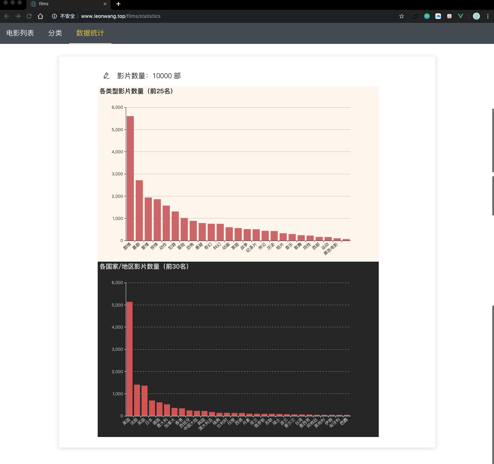

# Films

> 电影web应用，类似豆瓣电影、IMDb
>
> 前端由 Vue.js 实现，后端由 Go + echo 实现

### DEMO

[http://www.leonwang.top/films](http://www.leonwang.top/films)

### 功能

1. 电影列表
2. 电影分类浏览
3. 电影详情页
4. 搜索功能（包括按名称、按导演、按演员、按剧情等多种搜索方式）
5. 数据统计及可视化

### 技术栈介绍

- 数据库：MongoDB
- 后端：Go + echo  
- 前端：Vue.js + Element UI + echarts.js

### 界面

**主页**


**详情页**


**数据统计页**



### 运行步骤

**导入数据**

进入`importData`目录

```
python writeJson.py
```

**后端**

进入`backend`目录

```
go run main.go
```

**前端**

进入`frontend`目录

```
npm install
npm run dev
```

